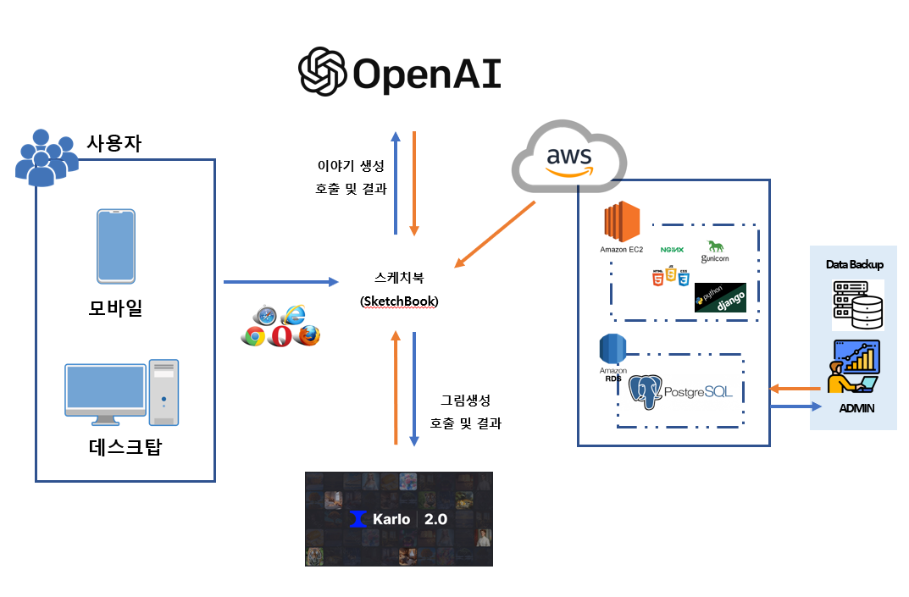

# sketchbook (2023/07/28)
### 한번쯤 꿈꿔 봤던 동화작가가 될 수 있는 공간

---


안녕하세요! 여러분들의 상상력과 창의력을 자유롭게 펼칠 수 있는 동화 작가의 공간, 스케치북 입니다.
스케치북은 생성형 인공지능을 활용하여 어린이부터 어른까지 누구나 동화 작가가 될 수 있는 특별한 공간입니다.

주인공과 주변 인물들을 설정하고, 키워드나 문장을 가지고 이야기를 언어 모델로 생성하고
이야기에 맞는 동화를 그림 모델로 생성하여 하나의 동화를 만드는 프로젝트 입니다.

우리 모두가 가지고 있는 아름다운 상상력을 스케치북에 담아보세요. 간단한 키워드나 만들고 싶은 이야기,
아이디어를 자유롭게 적어보세요. 이곳에서는 어떤 규칙도 없이 자유롭게 상상하고 표현할 수 있습니다.


## 개발 배경

---
```
동화책을 좋아하는 아이에게 매번 새로운 동화책을 사주기 부담스러워
이야기를 만들어 줬지만, 동화를 제작하는 것이 생각보다 어려운 작업이 였습니다.
개인이 하기엔 이야기 구성, 기획, 그림 그리기 등 기술과 시간적 한계를
느끼게 되었고, 누구나 동화제작을 쉽고 편리하게 할 수 있는
프로그램이 필요하다 생각이 되어 시작하게 되었습니다.
```

## 목적

---
```
1) 누구나 비전문가도 쉽게 동화를 만들 수 있는 인터페이스 제공
2) 어린이들은 동화 제작을 통해 상상력을 발달시키고 창의적인 사고를 유도
3) 육아하는 부모들에게 비용 절감 효과
```

## Live Demo

---
Click [demo](http://43.200.86.18/)

## DevTools

---
1) 사용언어
   - BackEnd : Python & Django
   - FrontEnd : Javascript & jQuery
   - DataBase : PostgreSQL
2) 생성모델
   - 언어생성 : openAI / gpt-3.5-turbo 사용
   - 그림생성 : kakaobrain / karlo_2.0 사용

## Architecture

---


## License

---
Made By [Tpple](http://yunsell.site/portfolio)


---

## SW대회 정보
```
350개팀 참가 (학생70%/일반30%)
생활안전부문에 많이 지원함 / 우린 일반부문
출품작 내면 카카오에서 굿즈 재공
1차뽑에 50팀정도 뽑을예정
라이선스 문제가 제일 중요함 뽑힌 후에 자격박탈 될 수 있음
자유(학생/일반) 과제, 지정과제, 향상과제 별도 평가
오픈소스사용의 위주의 평가 기준을 만들었음
9/7일 개발 프로젝트 등록 (결과보고서,소스,시연동영상) / 13~14 발표
1차 합격 이후 고도화(멘토링 지원해줌 대기업 개발자들)
기능테스트 및 라이선스 검증(전문업체에서 진행)
```

## 설치방법

1. git clone https://github.com/yunsell/sketchbook.git

2. cd chatGPT_BlogPosting